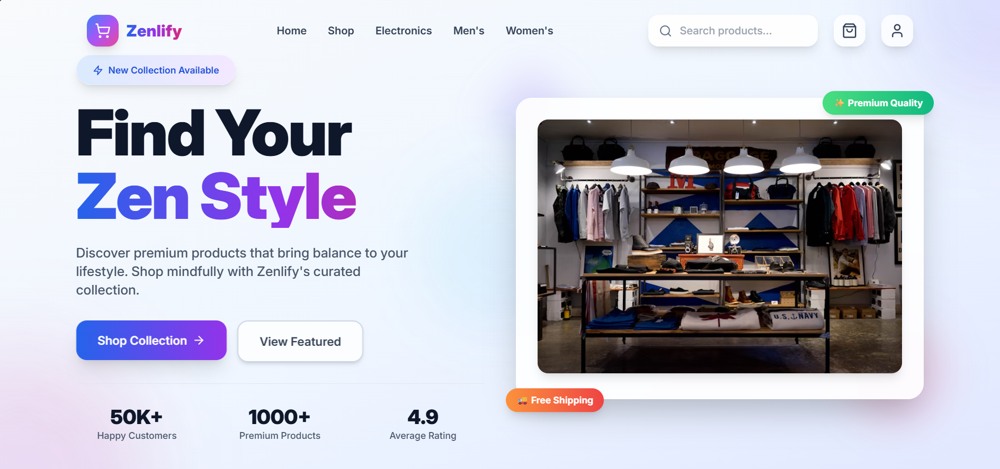
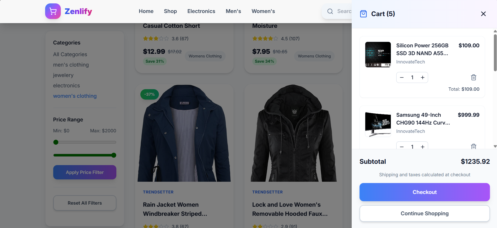

# 🛍️ Zenlify - E-Commerce Web Application

**Zenlify** is a modern and scalable e-commerce web application built with the MERN stack and Vite. It enables users to browse products, register/login, manage cart items, and complete the checkout process with a smooth user experience and intuitive interface.

---

## 📸 Screenshots

<!-- Add screenshots here if you have them -->
<!--  -->
<!--  -->

---

## 🚀 Live Demo

> 🧪 Coming Soon...

---

## 📦 Tech Stack

### 🔹 Frontend
- React.js
- Vite
- TailwindCSS
- Redux Toolkit (State Management)
- Axios

### 🔹 Backend
- Node.js
- Express.js
- MongoDB (future scope)
- JWT Authentication (future scope)

---

## 🌟 Features

- 🔐 User authentication (Login / Register)
- 🛒 Cart system with add/remove/update quantity
- 📄 Product listing & detail pages
- ✅ Checkout flow
- ⚛️ Reusable React components
- ⚙️ Modular folder structure for scalability
- 🔄 State management using Redux Toolkit

---

## 📁 Project Structure

